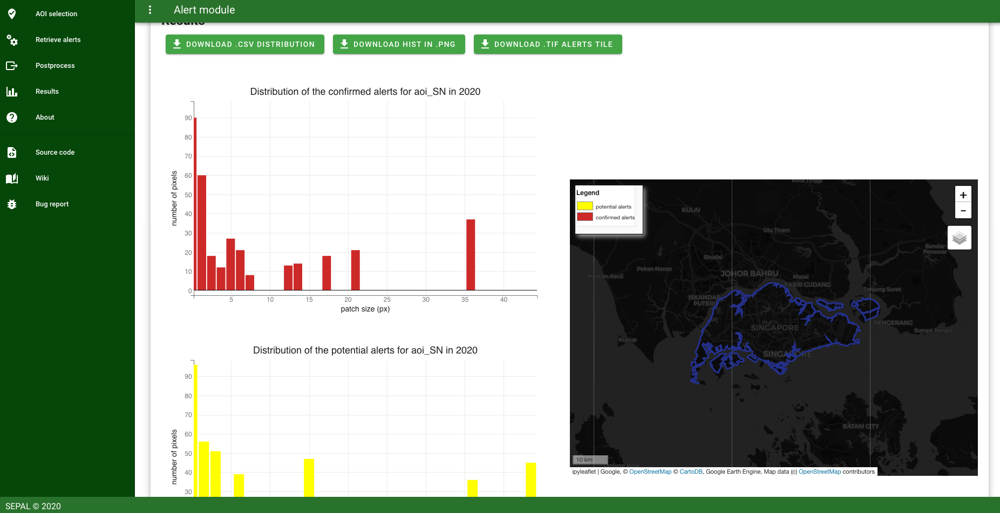

# GLAD alerts module

## about
this module is a 3 steps process that retreive and compute the GLAD alerts on a selected Aera of interest.

For more information please refer to:
- [Hansen et al. (2016) Humid tropical forest disturbance alerts using Landsat data. Environmental Research Letters 11 034008](https://iopscience.iop.org/article/10.1088/1748-9326/11/3/034008)
- [University of Maryland, GLAD alert dataset](https://glad.geog.umd.edu/dataset/glad-forest-alerts)


## Usage

### Step 1: AOI selection
In this first step you need to select a country using one of the provided method. This inputs will be processed in the following steps.

### Step 2: Retrieve alerts
In this second step, select a year to process the GLAD alerts. the input provided in step 1 will be processed in Google earth engine servers to provide tiles of the confirmed GLAD alert in the selected area of the selected year. If the process have already been launched the user will be asked to continue on the third step.

### Step 3: Postprocess
After verifying that the task is completed on Google earth engine drive, launching this third cell will import the files to a ~/glad_result folder in your Sepal environment. These files will be merged to provide a single map of the GLAD alerts on the selected country. Using this map, you'll create a output file containing the surface in pixel of each patch of Glad Alert and its classification (confirmed, likely). The tool provide some small visualisation of the data by diplaying the distribution of the GLAD Alert on the AOI.

### Results
The module allows you to display an histogram of the Glad alerts patches, download the raster and a .csv file of the results



for more information about usage please read the [documentation](doc/doc.md)

## contribute
to install the project on your SEPAL account 
```
$ git clone https://github.com/openforis/glad_alerts.git
```

please retreive the develop branch where all our development live
```
$ git checkout --track origin/develop
```

please follow the contributing [guidelines](CONTRIBUTING.md).


